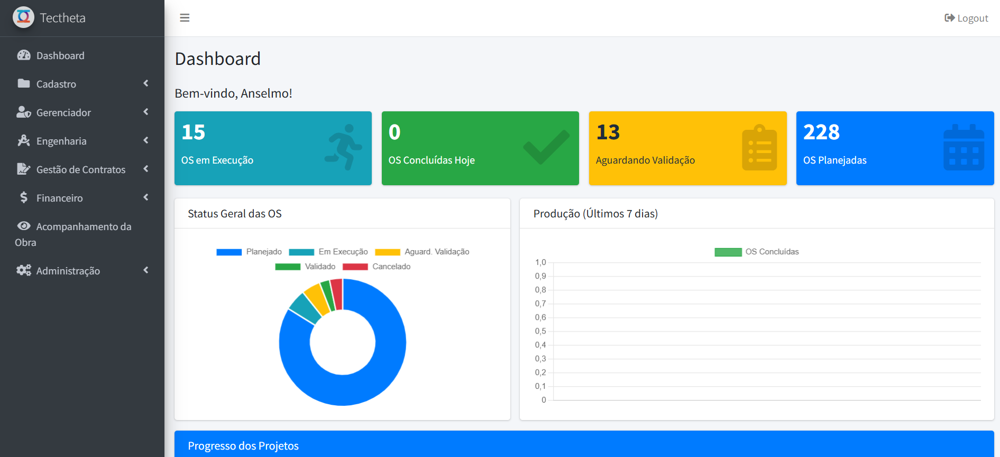
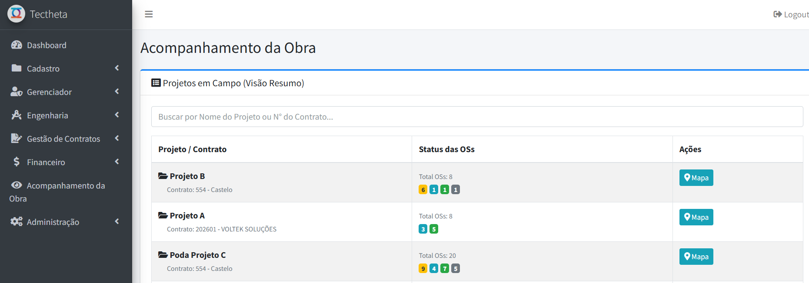
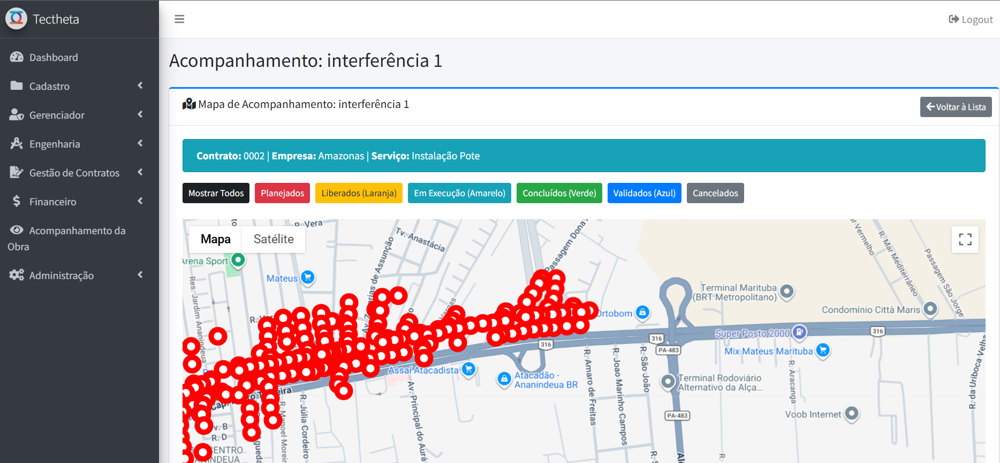
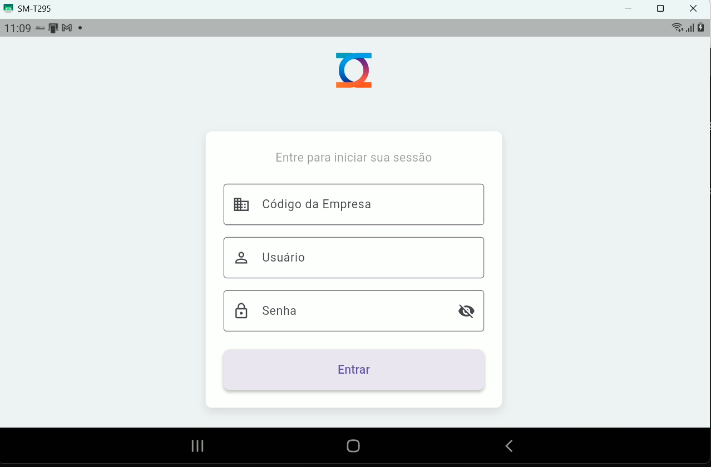
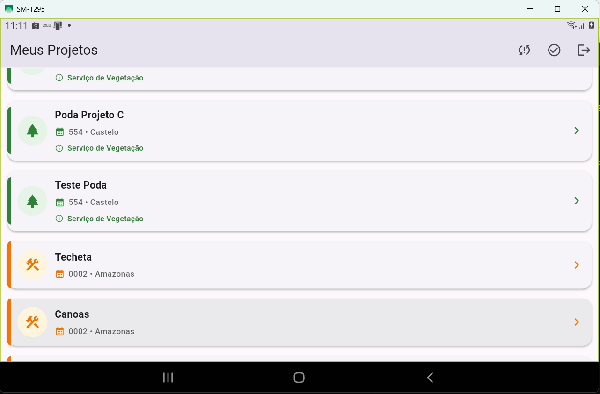
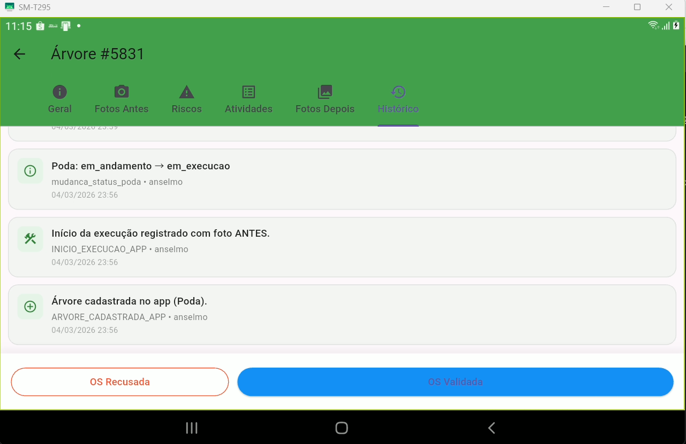

## 🚀 Highlights

- Plataforma completa integrando **Web + Mobile + Camada Analítica**
- Aplicação móvel **Offline-First** para operações em campo
- Arquitetura backend baseada em **MVC e APIs REST**
- Sistema projetado para **gestão de operações de engenharia e monitorização geográfica**

---


# Tectheta — Field Operations Data Platform


---

# 📌 Visão Geral

**Tectheta** é uma plataforma desenvolvida para gestão e análise de operações de engenharia de campo.

O sistema integra **três camadas principais**:

* **Sistema web administrativo** para gestão operacional
* **Aplicação móvel** utilizada por equipas em campo
* **Pipeline de dados** para análise e monitorização de indicadores operacionais

A plataforma foi concebida para ambientes onde a conectividade pode ser limitada, garantindo **integridade, rastreabilidade e consistência dos dados desde a recolha em campo até à camada analítica**.

---

# 🧱 Arquitetura da Plataforma

```
Mobile Application (Flutter)
        │
        │ Sincronização Offline
        ▼
REST API Backend (PHP)
        │
        │ Processamento Transacional
        ▼
Operational Database
        │
        │ Modelação Analítica
        ▼
Business Intelligence
```

Princípios arquiteturais aplicados:

* **Offline-First Mobile Architecture**
* **Front Controller Backend Pattern**
* **Arquitetura orientada a APIs**
* **Princípio DRY (Don't Repeat Yourself)**
* **Processamento transacional ACID**

---

# ⚙️ Capacidades da Plataforma

## Operações de Campo

* Gestão de equipas operacionais
* Registo de execução de atividades em campo
* Captura de evidências visuais (fotografia e vídeo)
* Georreferenciação de operações
* Auditoria operacional baseada em localização

---

## Gestão Operacional

* Planeamento e acompanhamento de projetos
* Gestão de contratos e recursos operacionais
* Monitorização da execução de serviços
* Controlo de medições operacionais

---

## Camada Analítica

* Consolidação de dados operacionais
* Modelação de indicadores de desempenho
* Integração com ferramentas de Business Intelligence
* Monitorização de produção e custos operacionais

---

# 📱 Aplicação Mobile

O aplicativo móvel foi desenvolvido com foco em **operações de campo e cenários com conectividade limitada**.

Características principais:

* armazenamento local em **SQLite**
* arquitetura **offline-first**
* sincronização automática quando há conectividade
* captura estruturada de dados operacionais

---

# 🛠️ Stack Tecnológica

## Backend

* PHP
* REST APIs
* Composer

## Mobile

* Flutter / Dart
* SQLite (armazenamento local)

## Frontend

* JavaScript
* AJAX
* Bootstrap / AdminLTE

## Dados

* SQL
* MySQL / PostgreSQL
* Modelação analítica

## Integrações

* APIs de geolocalização
* ferramentas de Business Intelligence

---

# 🖥️ Interface do Sistema

### Dashboard Operacional



---

### Gestão de Projetos



---

### Monitorização em Mapa



---

# 📱 Aplicação Mobile

### Autenticação



---

### Projetos Disponíveis



---

### Histórico de Execução da OS



---

# 💡 Sobre o Projeto

Este repositório apresenta uma **visão arquitetural da plataforma Tectheta**, desenvolvida de forma independente como demonstração prática de competências em:

* arquitetura de software
* engenharia de dados
* integração mobile + backend
* plataformas operacionais para equipas de campo

A implementação completa do sistema não é exposta neste repositório.

---

# 👤 Autor

José Moura Jr

LinkedIn
https://www.linkedin.com/in/josemourajr/
